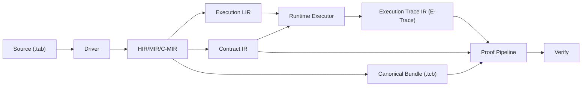

# Compiler-Proof Co-Design Architecture (Optimal)

> Date: 2026-02-20  
> Scope: Integrated final design for compiler/runtime/proof co-design around M11 O2  
> Inputs:
> - `docs/design/compiler-research-architecture.md`
> - `docs/design/m11-o2-implementation-plan.md`
> - `docs/design/m11-o2-codesign-with-compiler-architecture.md`
> - `docs/design/m11-o2-optimal-codesign-design.md`

---

## 1. Final Decision Summary

The final design is **Option B+**:

1. Keep M11 O2 scope for soundness closure (G1~G4) as the execution baseline.
2. Add a mandatory **Contract Spine V1** now to avoid M12/M13 refactor churn.
3. Defer high-blast-radius radical changes (chip consolidation, full codegen, statement v2 hash anchoring) until after M13 baseline.

In short:
- aggressive target architecture,
- staged implementation.

---

## 2. Why Co-Design Is Non-Optional

Compiler and proof are currently coupled by behavior, but not by explicit shared contracts.
This creates repeated drift risk.

Concrete evidence from current tree:

1. CLI still owns semantic checks
- `crates/cli/src/io.rs`
- `crates/cli/src/commands/compile.rs`
- `crates/cli/src/commands/check.rs`

2. IR canonicalization still mutates semantics
- `crates/ir/src/pass/canonicalize/nf4_alias_guard.rs`
- `crates/ir/src/program.rs`

3. Proof contract ownership is fragmented
- `crates/proof/src/statement.rs`
- `crates/proof/src/air/bus.rs`

4. Runtime/proof trace identity is not fully frozen at a shared boundary
- `crates/proof/src/witness/types.rs`
- `crates/proof/src/air/chips/execution/air.rs`
- `crates/proof/src/air/chips/inter_tx_order/air.rs`

5. Hash semantics can diverge by backend/policy placement
- `crates/core/src/traits/crypto.rs`
- `crates/commitment/src/poseidon.rs`

If these evolve independently, O2 fixes will not remain stable.

---

## 3. Co-Design Target State



Design rule:
- runtime and proof never define statement/bus schema independently.
- one schema owner, one semantic decision path.

---

## 4. Contract Spine V1 (Must Freeze in M11)

## 4.1 Contract Schema V1

Ownership:
1. short term: `tabula-proof::contract/`
2. mid term: extract into `tabula-contract`

Mandatory fields:
1. `contract_schema_version`
2. bus schema registry
3. statement binding registry
4. deferred reason code enum

## 4.2 Trace Identity V1

Mandatory now:
1. C10/C11 payload includes `tx_index`

Reserved now (not required in current bus):
1. `effect_ordinal_in_tx` in trace contract extension slot

Anchor policy:
1. M11 default = `tx_index` anchor for C10/C11
2. `tau` semantics remain valid where already used, but bus identity anchor for O2 is `tx_index`
3. Any future dual-anchor introduction must be versioned

## 4.3 Binding Completeness V1

Each `ApplyBatchStatement` field must be exactly one state:
1. `BoundInAir`
2. `Deferred { reason_code, owner, milestone }`

No implicit state, no undocumented partial state.

## 4.4 Metadata Envelope V1 (Pre-`.tcb`)

Before full canonical bundle rollout, proof compatibility checks still need canonical metadata.

Define one canonical envelope generated by driver/registration path:

```rust
pub struct ContractMetadataEnvelope {
    pub profile_hash: [u8; 32],
    pub contract_schema_version: u32,
    pub statement_binding_version: u32,
    pub semantic_hash_stub: Option<[u8; 32]>,
}
```

Rules:
1. proof entry consumes this envelope only.
2. CLI must not synthesize compatibility values independently.
3. mismatch is hard-fail.

## 4.5 Delete-All Rule Coupling

Delete-all behavior must be represented in both:
1. AIR constraints
2. contract metadata rule registry

Required rule:
- `Com_new` receive multiplicity for non-tag columns is gated by `is_touched * (1 - is_empty_new)`.

This prevents “constraints changed but contract docs stale” drift.

---

## 5. Bus Schema V2 Strategy (C10/C11)

### 5.1 Immediate requirement

Adopt C10/C11 v2 with `tx_index` now.

Target tuple:
- `(t, c, key[3], tx_index, val[W], is_null)`

### 5.2 Type hardening strategy (staged)

Use staged hardening instead of one-shot risky refactor.

Stage 1 (M11 safe):
1. add shared payload builder helpers in `air/bus.rs`
2. eliminate raw ad hoc tuple assembly from execution/inter_tx_order paths

Stage 2 (M12 entry):
1. promote to explicit typed payload wrapper

```rust
pub struct AccessTuple<T, const W: usize> {
    pub table: T,
    pub col: T,
    pub key: [T; 3],
    pub tx_index: T,
    pub value: [T; W],
    pub is_null: T,
}
```

This approach gets drift protection now without overloading M11 with generic-bound churn.

---

## 6. Package Plan (Integrated)

## Package A (Immediate, low-risk, M11)

Crates:
- `tabula-proof`, `tabula-core`, `tabula-cli`, `tabula-executor`

Deliver:
1. O2 contract skeleton with extraction-ready API
2. C10/C11 v2 (`tx_index`) + schema version bump
3. statement binding registry + tests
4. runtime trace identity metadata export
5. delete-all contract rule registry entry

## Package B (Parallel with compiler-driver work)

Crates:
- `tabula-driver` (new), `tabula-cli`, `tabula-ir`

Deliver:
1. CLI semantic checks migrate into driver
2. compile/check/execute/prove follow one semantic path
3. profile mismatch hard-fail policy
4. metadata envelope produced by driver path

## Package C (M12 entry gate)

Crates:
- `tabula-runtime` / `tabula-executor`, `tabula-proof`, `tabula-contract` (new)

Deliver:
1. typed canonical E-Trace schema
2. proof consumes E-Trace + contract schema
3. cross-crate drift tests for bus/statement binding

## Package D (Spec-policy sync gate)

Docs:
- `docs/spec/proof-spec.md`
- `docs/spec/semantics-spec.md`
- `docs/design/*`

Deliver:
1. explicit anchor policy text
2. explicit bound/deferred statement policy
3. contract versioning rules

Without D, implementation and spec can pass independently while semantics diverge.

---

## 7. O2 PR Mapping (Execution-Ready)

## PR-1 (Contract skeleton)

Add:
1. contract schema version
2. binding registry
3. deferred reason code enum

Gate:
1. binding completeness tests

## PR-2 (C10/C11 v2)

Add:
1. `tx_index` in payload
2. shared tuple builders
3. execution/inter_tx_order atomic update

Gate:
1. schema snapshot tests for C10/C11 arity/order

## PR-3 (Touched-write closure)

Add:
1. state_column write_seen closure constraints
2. negative tests for touched forgery

Gate:
1. forged witness rejection tests

## PR-4 (Delete-all closure)

Add:
1. C6 `Com_new` gating rule update
2. contract metadata rule update

Gate:
1. delete-all scenario matrix tests

## PR-5 (Infra hardening)

Add:
1. remove C6/C8 placeholders
2. release gates for schema + binding

Gate:
1. `cargo test -p tabula-proof --features stark`
2. `cargo clippy -p tabula-proof --all-targets --features stark`

---

## 8. Adopt / Defer Decisions

| Item | Decision | Timing | Reason |
|---|---|---|---|
| C10/C11 `tx_index` anchor | Adopt | M11 | closes G3 directly |
| Binding registry (`Bound`/`Deferred`) | Adopt | M11 | closes G4 foundation |
| delete-all contract+constraint atomicity | Adopt | M11 | closes G2 without drift |
| metadata envelope + hard-fail checks | Adopt | M11/M11.5 | enables safe transition before `.tcb` |
| full typed E-Trace production in runtime | Defer | M12 | implementation surface is wider |
| `tabula-contract` crate extraction | Defer (planned) | M12 | avoid M11 schedule risk |
| Contract DSL + codegen | Defer | M13+ | high leverage but higher setup cost |
| semantic hash as statement public input | Defer | v2 protocol | protocol impact and governance |
| O3 chip consolidation | Defer | post-M13 baseline | high blast radius |

---

## 9. Non-Negotiable Gates (O2 -> M12)

1. **Schema Snapshot Gate**
- C10/C11 tuple shape and order are version-snapshot tested.

2. **Binding Completeness Gate**
- every statement field is `BoundInAir` or `Deferred(...)`.

3. **Anchor Coherence Gate**
- selected anchor fields are coherent across runtime output, witness rows, and bus fingerprints.

4. **Delete-All Contract Gate**
- delete-all multiplicity behavior is encoded in AIR + contract metadata.

5. **Metadata Source Gate**
- proof compatibility checks consume driver-produced envelope only.

6. **Single Semantic Path Gate**
- no CLI-local semantic validation remains on the hot path.

---

## 10. Risks and Mitigations

| Risk | Impact | Mitigation |
|---|---|---|
| M11 scope creep | High | keep Package A minimal and defer M12+ items |
| Generic/type churn for bus payload wrappers | Medium | stage hardening: builder first, wrapper second |
| Spec drift vs implementation | Medium | Package D and CI gate |
| Temporary dual-path behavior | Medium | explicit feature/version guard and deprecation plan |
| Metadata mismatch ambiguity | High | one metadata envelope source from driver |

---

## 11. Anti-Patterns to Avoid

1. introducing another proof-local schema table without versioning
2. keeping free-form correctness strings as machine decision contract
3. retaining CLI semantic checks after driver path exists
4. continuing semantic guard insertion without obligation provenance
5. delaying profile/contract mismatch checks until M13

---

## 12. Final Recommendation

Adopt co-design aggressively, but with staged control.

1. **Now (M11):** O2 + Contract Spine V1 (schema, binding, anchor, metadata envelope).
2. **Next (M12):** extract `tabula-contract`, freeze E-Trace contract, unify proof inputs.
3. **Then (M13+):** codegen, obligation-proof bridge hardening, optional statement v2 semantic hash anchoring.

This yields the best balance between immediate soundness closure and long-term architecture stability.
