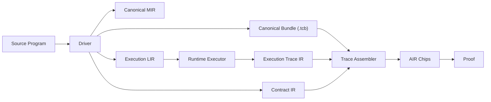

# M11 O2 Co-Design 분석: Proof x Compiler/Runtime 통합 아키텍처

> Date: 2026-02-20  
> Scope: `docs/design/m11-o2-implementation-plan.md`와 compiler-research 아키텍처의 정합성/통합 가능성 분석  
> Related:
> - `docs/design/m11-o2-implementation-plan.md`
> - `docs/design/compiler-research-architecture.md`
> - `docs/design/proof-architecture-adoption-review.md`

---

## 1. 결론 요약

현재 M11 O2 설계는 방향이 정확하다. 다만 O2를 proof 내부 로컬 개선으로만 끝내면, M12/M13에서 다시 “계약/의미/스키마 드리프트”를 겪을 가능성이 높다.

따라서 **권장 전략은 O2 + Co-Design Spine(계약/프로파일/아티팩트 경계) 동시 도입**이다.

핵심 권고:

1. O2의 `contract/`는 proof 내부 구현으로 시작하되, 즉시 `tabula-contract`로 승격 가능한 API 모양으로 설계한다.
2. C10/C11 `tx_index` 앵커를 도입할 때, 런타임/위트니스/AIR가 공유하는 **AccessTuple 타입**으로 통합한다.
3. `ApplyBatchStatement` 바인딩 상태를 코드+테스트로 고정하되, 장기적으로는 `SemanticProfileHash`/`ContractHash`를 public statement에 포함하는 v2를 준비한다.
4. M12 trace builder는 witness 조립기가 아니라 **Contract IR 기반 assembler**로 설계한다.

---

## 2. 왜 지금 co-design이 필요한가

`m11-o2-implementation-plan.md`는 G1~G4 폐쇄를 목표로 하며, 이는 soundness 측면에서 필수다.

하지만 현재 코드 상태를 보면 구조적 중복/드리프트 가능성이 남아 있다:

1. 버스 스키마 정의와 실제 payload 조립이 분산됨
- `crates/tabula-proof/src/air/bus.rs`는 C10/C11 trait를 제공하지만,
- `crates/tabula-proof/src/air/chips/execution/air.rs`는 아직 raw `AirInteraction`로 payload를 수동 조립한다.

2. O2 문서는 C10/C11 `tx_index` 포함을 요구하지만 현재 버스 시그니처는 미반영
- C10/C11 tuple이 아직 `(t, c, key[3], val[W], is_null)` 형태.

3. statement 계약이 proof crate 로컬 구조에 머물러 있음
- `crates/tabula-proof/src/statement.rs` 단일 struct만 존재.
- binding 상태/버전/deferred 사유를 코드 수준으로 강제하는 독립 계층이 없음.

4. semantics/proof spec와 구현의 시간 앵커 모델이 혼재
- witness 타입은 `time` + `tx_index`를 모두 가짐 (`crates/tabula-proof/src/witness/types.rs`).
- proof-spec 일부 섹션은 global `tau` 중심 설명.
- O2는 `tx_index` 기반 anchor를 요구.

5. 컴파일러/CLI 쪽에서 제안한 profile-driven semantics와 proof 경계가 아직 연결되지 않음
- hash/codec/binding 정책이 아티팩트 단위로 강결합되어 있지 않음.

이 상태에서 O2만 적용하면, M12/M13에서 다시 계약 고정 작업이 필요해질 수 있다.

---

## 3. O2와 compiler-research 아키텍처의 겹침 지점

### 3.1 직접 겹침 (high overlap)

1. **Canonical Contract Layer**
- O2 PR-1의 핵심.
- compiler 아키텍처의 `Contract IR (K-IR)`과 동일 축.

2. **버스 스키마 단일화**
- O2 PR-2 C10/C11 v2.
- compiler 아키텍처의 “single semantic authority”와 동일 목표.

3. **Statement binding 상태표**
- O2 Done Definition #4.
- compiler 아키텍처의 “모든 public field는 Bound 또는 Deferred 명시”와 동일.

### 3.2 간접 겹침 (medium overlap)

1. **trace assembly 계약 고정(M12)**
- O2 결과가 M12 입력 계약으로 전달됨.
- compiler 아키텍처에서는 Driver/Artifact 계약으로 고정.

2. **실행 결과의 typed contract**
- O2는 proof bus 중심으로 개선.
- compiler 아키텍처는 execute/check/compile 결과를 typed response로 고정.

### 3.3 누락된 겹침 (gap)

1. `SemanticProfile`과 proof contract 연결.
2. compiler obligation(예: alias distinctness)과 proof-level assertion/bus binding 연결.
3. artifact hash/contract version과 statement binding의 강제 결합.

---

## 4. Co-Design 목표 구조 (권장)



요지:
- O2가 만드는 proof contract를 “proof 전용 내부 모듈”로 끝내지 않고,
- M12부터 driver/artifact/runtime와 공유 가능한 IR 계약으로 승격한다.

---

## 5. 즉시 적용 가능한 Co-Design 제안 (M11-safe)

아래는 M11 O2 일정에 크게 무리 없이 동시 도입 가능한 제안이다.

## C1. `contract/`를 extraction-ready로 설계

현재 O2 PR-1에서 `crates/tabula-proof/src/contract/`를 도입할 때 다음을 강제:

1. 순수 데이터 타입 중심 (`serde` + `borsh` 가능성 고려)
2. chip 내부 타입 의존 최소화
3. `version` 필드 포함
4. `BindingStatus::Deferred(reason_code)`의 reason code 표준화

이렇게 하면 M12에서 `tabula-contract` crate로 이동할 때 파급이 작다.

---

## C2. C10/C11 v2를 “타입”으로 고정

버스 스키마를 함수 시그니처가 아니라 구조체/trait 조합으로 고정:

```rust
pub struct AccessTuple<T, const W: usize> {
    pub table: T,
    pub col: T,
    pub key: [T; 3],
    pub tx_index: T,
    pub value: [T; W],
    pub is_null: T,
}
```

적용 포인트:
1. `air/bus.rs`: C10/C11 send/receive가 `AccessTuple`를 받게 변경
2. `execution/air.rs`: raw `AirInteraction` 수동 조립 제거
3. `inter_tx_order/air.rs`: receive도 동일 tuple 사용
4. `tests/infra/bus.rs`: tuple equality 테스트 재사용

효과:
- payload order drift를 컴파일 타입 경계에서 차단.

---

## C3. 시간 앵커 정책을 O2 단계에서 명시적으로 선택

현재 선택지:

1. `tx_index` only (O2 문서 기본)
2. `tau` only (일부 spec 흐름)
3. `tx_index + tau` dual anchor

권장: **M11은 `tx_index` 우선**, 단 contract schema에 `access_order_anchor` 확장 슬롯을 reserved 처리.

이유:
- 당장 G3를 닫는 최소 변경.
- M12에서 global ordering이 필요하면 `tau`를 backward-compatible하게 추가 가능.

---

## C4. Statement binding 상태표를 테스트 게이트로 승격

O2의 `StatementBindingMap`를 다음 규칙으로 강화:

1. 필드별 상태 + 근거 + milestone tag 포함
2. `BoundInAir`는 해당 AIR assertion 위치를 참조 ID로 연결
3. `Deferred`는 unblock milestone과 TODO ID를 포함

예시:

```rust
Deferred {
  reason: "M12_TX_DIGEST_BINDING_PENDING",
  owner: "trace_builder",
  milestone: "M12",
}
```

효과:
- 문서 drift가 아니라 테스트 실패로 바로 노출.

---

## C5. delete-all 규칙을 Contract 수준에도 반영

O2 PR-4에서 `ColumnMeta` C6 게이트를 바꿀 때, contract schema에도 규칙을 명시:

- `Com_new` receive multiplicity rule = `is_touched * (1 - is_empty_new)`

즉, constraint 변경과 계약 변경을 분리하지 말고 같은 PR에서 갱신.

---

## 6. M12에서 반드시 묶어야 하는 Co-Design

## C6. Witness 중심이 아니라 `Execution Trace IR` 중심으로 전환

현재 `witness/types.rs`는 사실상 E-Trace의 proto 형태(`AccessRow`)를 이미 갖고 있다.

M12에서 권장:
1. `AccessRow`를 runtime이 직접 산출하는 canonical E-Trace로 승격
2. proof witness generator는 E-Trace를 소비
3. chip trace builder는 E-Trace + Contract IR만 소비

효과:
- executor/proof 간 중복 변환/재해석 제거.

---

## C7. Trace Assembler 입력 계약 고정

Trace assembler 입력을 3개로 고정:

1. `Contract IR`
2. `Execution Trace IR`
3. `SemanticProfile`

이는 compiler-research 문서의 K-IR/X-LIR/TCB 설계와 정합적이며,
M13 prover integration에서도 재사용 가능하다.

---

## C8. Program/batch/static commitments의 provenance 연결

`ApplyBatchStatement`에서 deferred 중인 필드(`program_root`, `applied_tx_digest`, `static_table_root`, `budgets`)는
M12에서 생성 책임 주체를 명확히 분할:

1. `program_root`: compiler artifact/driver
2. `applied_tx_digest`: executor/trace pipeline
3. `static_table_root`: static table provider + contract
4. `budgets`: profile + program header

각 필드의 생성 책임을 분리하지 않으면 M13에서 verifier contract가 모호해진다.

---

## 7. 급진적 제안 (M13+ 또는 별도 트랙)

아래는 바로 적용하면 리스크가 크지만, 장기 완성도를 크게 높일 수 있는 옵션들이다.

## R1. O3++: `InterTxOrder + StateColumn`을 넘어 Access-State 단일 칩으로 통합

현재 C10/C11/C13/C14/C6 경로를 하나의 state transition ledger chip으로 통합:

1. Access log ingest
2. init/opening consistency
3. write coalescing
4. old/new commitment chain emission

장점:
- cross-chip bus complexity 감소
- soundness invariant을 단일 transition으로 표현 가능

단점:
- blast radius가 매우 큼
- M11/M12 일정에는 부적합

권장 시점: M13 baseline 이후.

---

## R2. Contract-Driven AIR codegen

`Contract IR`에서 bus tuple, interaction kind, public value offsets를 생성 코드로 만들기.

장점:
- 스키마 불일치 클래스를 구조적으로 제거
- infra test boilerplate 감소

단점:
- 코드 생성 파이프라인 도입 비용

---

## R3. `ApplyBatchStatementV2`에 semantic identity 포함

`old/new root` 외에 아래를 public input으로 포함하는 확장:

1. `semantic_hash`
2. `contract_hash`
3. `profile_hash`

장점:
- “같은 실행 결과처럼 보이지만 다른 의미체계” 공격면 축소
- compile/run/prove 동형성 강화

단점:
- statement 변경 비용
- verifier/consumer 업데이트 필요

---

## R4. Compiler Obligation -> Proof Obligation 브리지

compiler에서 생성한 obligation(예: DistinctRows)을 proof contract의 assertion map으로 전달.

1. static discharge된 obligation은 metadata로 기록
2. runtime materialized obligation은 execution/assert 이벤트로 추적
3. proof는 해당 obligation set의 completeness를 검증

효과:
- NF/alias 정책이 “컴파일러 규칙”과 “증명 규칙”으로 이원화되지 않음.

---

## 8. 권장 채택안 (실행 가능성 기준)

### Option A: O2만 수행
- 장점: 일정 안전
- 단점: M12/M13에서 계약 승격 재작업 가능성 높음

### Option B (권장): O2 + M11-safe Co-Design(C1~C5)
- 장점: 일정 영향 제한 + 재작업 최소화
- 단점: PR당 설계 검토 부담 증가

### Option C: O2 + M11/M12 동시 대개편(C1~C8)
- 장점: 장기 완성도 높음
- 단점: M11 completion 지연 리스크

최종 권고: **Option B 채택 후, M12 시작과 함께 C6~C8 즉시 진행**.

---

## 9. PR 단위 통합 실행 제안

O2 기존 PR 계획과 co-design 작업을 매핑:

1. PR-1 (Contract skeleton)
- C1 + C4 반영
- 산출물: `binding map + schema version + deferred reason code`

2. PR-2 (C10/C11 v2)
- C2 + C3 반영
- 산출물: `AccessTuple` 타입 기반 bus send/receive

3. PR-3 (touched-write closure)
- 상태 전이 제약 + contract invariant 문구 동시 갱신

4. PR-4 (delete-all closure)
- C5 반영: contract rule과 constraint를 atomic 반영

5. PR-5 (infra test 완결)
- binding map/tuple schema를 release gate로 추가

---

## 10. 검증/게이트 제안

기존 O2 체크리스트 외 추가:

1. Contract schema snapshot test
- 버스 tuple field/order/width 변경 시 명시 승인 필요

2. Binding map completeness test
- `ApplyBatchStatement` 필드 전부가 Bound/Deferred 상태를 가져야 함

3. Payload equivalence test
- `execution send tuple == inter_tx_order receive tuple`

4. Time anchor coherence test
- 선택된 anchor(`tx_index`)가 witness->air->debug checker까지 일관

5. Deferred debt budget
- Deferred 항목 수가 증가하면 CI 실패 (또는 explicit waiver 필요)

---

## 11. 최종 제언

M11 O2는 이미 soundness 관점에서 올바른 해법이다.
완성도를 한 단계 올리려면, O2를 proof 로컬 패치가 아니라 **계약 중심 co-design의 시작점**으로 정의해야 한다.

즉,
- M11: O2 + C1~C5로 계약 spine 구축
- M12: C6~C8로 runtime/compiler/proof 입력 계약 통일
- M13+: 급진 옵션(R1~R4) 검토

이 경로가 일정/리스크/완성도의 균형이 가장 좋다.
