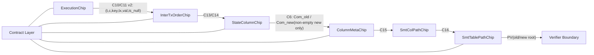

# M11 O2 구현 설계 및 실행 계획

> Date: 2026-02-20  
> Owner: `tabula-proof`  
> Related:
> - `docs/design/proof-architecture-adoption-review.md`
> - `docs/design/m11-o2-codesign-with-compiler-architecture.md`

---

## 1. 목표

M11에서 **O2(점진적 아키텍처 도입)** 를 완료해, 아래를 달성한다.

1. 알려진 soundness 공백(G1~G4) 폐쇄
2. M12 trace assembly 계약(버스/공개입력 스키마) 고정
3. M13 prover/verifier 통합 시 재작업 최소화

---

## 2. Done Definition (O2)

아래 6개가 모두 충족되면 O2 완료로 본다.

1. C10/C11 버스에 `tx_index`가 포함되고, Execution↔InterTxOrder가 동일 payload로 결합된다.
2. `segment_is_touched`가 segment 내 write 존재성과 AIR에서 동치로 강제된다.
3. delete-all 케이스(`is_touched=1 && is_empty_new=1`)가 C6 경로와 모순 없이 폐쇄된다.
4. `ApplyBatchStatement` 각 필드의 binding 상태가 단일 계약 레이어에서 명시된다.
5. C6/C8 infra 테스트 placeholder가 제거되고 실제 검증 테스트가 추가된다.
6. 문서/테스트 기준으로 “M11 완료 범위”와 “M12/M13 이관 범위”가 분리된다.

---

## 3. 범위

### 3.1 In Scope

- Proof contract 레이어 도입
- C10/C11 payload v2 (`tx_index` 포함)
- StateColumn touched-write closure
- delete-all 명시 처리(Com_new receive 게이팅)
- C6/C8 infra 테스트 실구현

### 3.2 Out of Scope

- O3: `InterTxOrder + StateColumn` 칩 통합
- Plonky3 prover/verifier 구현
- `ApplyBatchStatement` 6필드 전부의 AIR-level 완전 binding

---

## 4. 현재 이슈와 O2 매핑

| 이슈 | 현재 상태 | O2 해결 방식 |
|---|---|---|
| G1 touched-write 분리 | write가 있어도 touched=0 위조 가능성 | StateColumn에 write 누적 불변식 추가, segment end에서 `segment_is_touched == write_seen` 강제 |
| G2 delete-all 경로 불명확 | touched인데 new-entry 없음 케이스 취약 | ColumnMeta C6 Com_new receive를 `is_touched*(1-is_empty_new)`로 제한 |
| G3 C10/C11 anchor 부재 | tx ordering witness가 Execution과 약결합 | C10/C11 payload에 `tx_index` 추가 |
| G4 statement 계약 불명확 | 6필드 중 실제 binding 범위 혼재 | contract 레이어에서 필드별 binding 상태 명시/테스트 강제 |
| G6 C6/C8 테스트 공백 | placeholder | 실테스트로 교체 |

---

## 5. 타겟 아키텍처 (O2 적용 후)



---

## 6. 상세 설계

## 6.1 계약 레이어 (`contract/`)

### 목적

- “어떤 공개입력이 어떤 칩에서 어떻게 바인딩되는지”를 단일 원천으로 고정한다.
- 버스 payload 스키마를 타입/상수 수준에서 고정한다.

### 신규 모듈 제안

- `crates/tabula-proof/src/contract/mod.rs`
- `crates/tabula-proof/src/contract/public_values.rs`
- `crates/tabula-proof/src/contract/bus_schema.rs`
- `crates/tabula-proof/src/contract/statement_binding.rs`

### 핵심 타입 제안

```rust
pub enum BindingStatus {
    BoundInAir,
    Deferred(&'static str), // 예: "M12: tx digest binding"
}

pub struct StatementBindingMap {
    pub old_state_root: BindingStatus,
    pub new_state_root: BindingStatus,
    pub program_root: BindingStatus,
    pub applied_tx_digest: BindingStatus,
    pub static_table_root: BindingStatus,
    pub budgets: BindingStatus,
}
```

### O2 시점 기대 상태

- `old_state_root`, `new_state_root`: `BoundInAir`
- 나머지 4필드: `Deferred(...)` (명시적)

---

## 6.2 C10/C11 버스 스키마 v2

### 변경 목표

Execution의 access 이벤트와 InterTxOrder의 tx ordering witness를 같은 fingerprint로 결합한다.

### 스키마

- C10 ReadAccess: `(t, c, key[3], tx_index, val[W], is_null)`
- C11 WriteAccess: `(t, c, key[3], tx_index, val[W], is_null)`

### 변경 파일

- `crates/tabula-proof/src/air/bus.rs`
- `crates/tabula-proof/src/air/chips/execution/air.rs`
- `crates/tabula-proof/src/air/chips/inter_tx_order/air.rs`
- `crates/tabula-proof/tests/infra/bus.rs`
- `crates/tabula-proof/tests/infra/integration.rs`

### 구현 원칙

1. C10/C11은 **동시에** 마이그레이션 (부분 적용 금지)
2. payload 조립 함수는 버스 모듈에 단일화
3. tx index 값은 Execution row의 `local.tx_index`를 사용

---

## 6.3 StateColumn touched-write closure

### 문제

현재 `segment_is_touched`는 boolean/segment constancy만 있고 write 존재성과 직접 연결되지 않는다.

### 해결

`StateColumnCols`에 `write_seen`(bool) 컬럼 추가:

- first row: `write_seen = in_write`
- same segment transition:  
  `next.write_seen = write_seen OR next.in_write`
- segment boundary:
  `segment_is_touched = write_seen`

### 변경 파일

- `crates/tabula-proof/src/air/chips/state_column/columns.rs`
- `crates/tabula-proof/src/air/chips/state_column/air.rs`
- `crates/tabula-proof/src/air/chips/state_column/trace.rs`
- `crates/tabula-proof/tests/chips/state_column.rs`

### 추가 권장 (동일 PR 내)

`past_last_new_entry` 컬럼 추가로 new-chain completeness를 old-chain과 대칭화:

- `is_last_new_entry` 지정 후 추가 `in_new` 금지
- segment end에서 new-entry 존재 시 last-new coverage 강제

이 항목은 delete-all과 결합되어 C6 신호의 정확성을 높인다.

---

## 6.4 delete-all 경로 명시 처리

### 정의

delete-all: 해당 `(t,c)` segment에 write는 있었지만 new-list에 남는 entry가 0개인 경우.

### 설계 규칙

1. touched + non-empty-new: C6에서 `Com_new`를 StateColumn에서 받아야 함
2. touched + empty-new: C6에서 `Com_new`를 받지 않고, ColumnMeta의 `Com_empty` 제약으로 닫음
3. untouched: `com_new == com_old`

### 구체 변경

`ColumnMeta`의 C6 Com_new receive multiplicity를:

`is_real * not_tag * is_touched * (1 - is_empty_new)`

로 변경.

### 변경 파일

- `crates/tabula-proof/src/air/chips/column_meta/air.rs`
- `crates/tabula-proof/tests/chips/column_meta.rs`
- `crates/tabula-proof/tests/infra/integration.rs`

---

## 7. 구현 순서 (PR 단위)

## PR-1: Contract skeleton + 테스트

### 작업

- `contract/` 모듈 추가
- statement binding 상태표 추가
- binding status 테스트 추가

### 목표

기능 변화 없이 계약 명세를 코드화.

---

## PR-2: C10/C11 payload v2

### 작업

- 버스 trait 시그니처에 `tx_index` 추가
- Execution send / InterTxOrder receive 동시 업데이트
- C10/C11 infra 테스트 전면 갱신

### 목표

Execution↔InterTxOrder ordering anchor 완성.

---

## PR-3: touched-write closure (+new-chain completeness)

### 작업

- StateColumn 컬럼/제약/trace 업데이트
- 음성(soundness) 테스트 추가:
  - write 있음 + touched=0 위조 실패
  - same segment 내 write_seen 전파 위조 실패
  - (선택) last_new 관련 위조 실패

### 목표

G1 폐쇄.

---

## PR-4: delete-all 경로 폐쇄

### 작업

- ColumnMeta Com_new receive 게이트 수정
- delete-all e2e fixture 추가
- touched/non-empty/empty 조합 테스트 추가

### 목표

G2 폐쇄.

---

## PR-5: C6/C8 infra test 완결 + 문서 freeze

### 작업

- `tests/infra/bus.rs` placeholder 제거
- C6/C8 실 테스트 작성
- O2 완료 기준 문서화 반영

### 목표

회귀 방지 체계 확립.

---

## 8. 테스트 전략

## 8.1 단위 테스트

- bus payload 길이/순서 테스트
- contract binding status 테스트
- StateColumn 신규 컬럼(boolean, 전파) 제약 테스트

## 8.2 음성(soundness) 테스트

- C10/C11: 동일 `(t,c,key,val)`인데 `tx_index`만 다르게 위조
- StateColumn: write 존재 + touched=0 위조
- delete-all: `is_empty_new=1`인데 C6 Com_new 수신 강제 위조

## 8.3 통합 테스트

- `Execution -> InterTxOrder -> StateColumn` 풀체인
- touched + non-empty-new / touched + empty-new / untouched 3분기
- SMT root e2e 기존 테스트와 공존 검증

## 8.4 명령

```bash
cargo test -p tabula-proof --features stark
```

필수 추가:

```bash
cargo clippy -p tabula-proof --all-targets --features stark
```

---

## 9. 리스크 및 대응

| 리스크 | 영향 | 대응 |
|---|---|---|
| 버스 시그니처 변경으로 연쇄 빌드 실패 | 중간 | PR-2에서 atomic 변경, compile-first 전략 |
| StateColumn 컬럼 증가로 trace 폭 상승 | 낮음~중간 | 최소 컬럼(우선 `write_seen`)만 도입, 필요시 2단계화 |
| delete-all 게이트 변경으로 기존 테스트 대량 수정 | 중간 | 시나리오별 픽스처 함수 공통화 |
| 계약 레이어가 문서와 다시 drift | 중간 | CI에서 binding status 테스트를 release gate로 지정 |

---

## 10. M12/M13 인터페이스 계약

## M12에 전달할 고정 계약

1. C10/C11 payload v2
2. touched 의미: “segment write 존재성”과 동치
3. delete-all 처리 규칙

## M13에 전달할 고정 계약

1. `old/new root` PV 오프셋과 길이
2. statement 필드별 binding 상태표
3. “BoundInAir 항목만 verifier completeness 대상” 규칙

---

## 11. 수용 기준 체크리스트

- [ ] C10/C11가 `tx_index` 포함 payload로 동작
- [ ] touched-write closure가 AIR에서 강제
- [ ] delete-all 경로가 C6/Com_empty와 모순 없이 통과
- [ ] statement binding status가 코드/테스트로 고정
- [ ] C6/C8 infra placeholder 제거
- [ ] `cargo test -p tabula-proof --features stark` green
- [ ] `cargo clippy -p tabula-proof --all-targets --features stark` green

---

## 12. 결론

O2는 “큰 구조 변경 없이 soundness 공백을 닫는” 현실적 경로다.  
M11에서는 O2를 완료해 계약을 고정하고, O3(칩 통합)는 M13 baseline 이후 별도 성능/복잡도 검토로 진행한다.

---

## 13. Co-Design 연계 원칙 (요약)

`m11-o2-codesign-with-compiler-architecture.md`의 권고를 기준으로,
O2 구현 시 아래 4가지를 같이 적용한다.

1. `contract/`는 proof 내부에서 시작하되 `tabula-contract`로 추출 가능한 데이터 중심 구조를 유지한다.
2. C10/C11 payload v2는 `AccessTuple` 타입 기반으로 고정하고 raw tuple 수동 조립을 금지한다.
3. statement binding status는 release gate 테스트로 관리한다.
4. M12 trace assembly 입력 계약은 `Contract IR + Execution Trace IR + SemanticProfile` 방향으로 고정한다.
