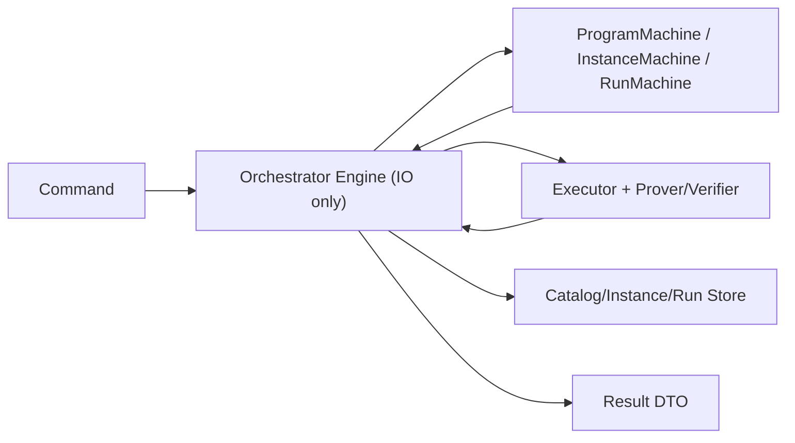

# Orchestrator State Machine Blueprint (V1)

Date: 2026-02-21  
Scope: `tabula-orchestrator` runtime control-plane

## 1) 목표

오케스트레이터를 “로직 구현체”가 아니라 **상태머신 실행기(orchestrating adapter)** 로 고정한다.

- 전이 규칙(guard/transition/evolve)은 `machine/*`만 소유
- `orchestrator/engine`은 IO/해시/실행/검증 호출과 저장소 반영만 수행
- 상태 단위(aggregate)를 명확히 분리: `Program`, `Instance`, `Run`

## 2) Aggregate 및 책임

### Program Aggregate

- 의미: 컴파일/등록된 프로그램 아티팩트의 불변 스냅샷
- 저장 필드 핵심: `program_id`, `program_hash`, `metadata_hash`, `profile_hash`, `artifact`
- 원칙: 등록 이후 내용 불변

### Instance Aggregate

- 의미: 특정 Program 위에서 진화하는 상태 헤드(head)
- 저장 필드 핵심: `instance_id`, `program_id`, `version`, `status`, `state_hash`, `state`
- 원칙: 커밋 성공 시에만 `version += 1`

### Run Aggregate

- 의미: 한 번의 batch 실행/증명/검증 결과 레코드
- 저장 필드 핵심: `run_id`, `instance_id`, `statement_hash`, `execution`, `proof`, `status`
- 원칙: `statement_hash`와 구성요소(program/state/batch/state_after/metadata)는 생성 후 불변

## 3) 상태머신 정의

## 3.1 Program Machine

현재 정책: Program은 등록 후 불변이며 삭제/수정 전이를 허용하지 않는다.

```mermaid
stateDiagram-v2
    [*] --> "Registered": "register_program(valid artifact)"
    "Registered" --> "Registered": "get/list"
```

전이 가드:

- driver 계약 검증 통과 (schema/tx/metadata fail-closed)
- `program_hash`, `metadata_hash` 계산 가능

## 3.2 Instance Machine

상태:

- `Active`
- `Archived`

```mermaid
stateDiagram-v2
    [*] --> "Active": "create_instance(program_id, initial_state)"
    "Active" --> "Active": "submit_run(commit=false)"
    "Active" --> "Active": "submit_run(commit=true, version++)"
    "Active" --> "Archived": "archive_instance (future)"
    "Archived" --> "Archived": "get/list"
```

핵심 가드:

- `start`: `status == Active`
- `start`: `expected_version`가 있으면 현재 `version`과 일치
- `commit`: live instance의 `version == start 시점 version`

핵심 불변식:

- commit=false 경로는 저장소 상태를 절대 mutate하지 않는다
- commit=true 성공 시에만 상태/해시/version이 함께 갱신된다

## 3.3 Run Machine

상태:

- `Succeeded`
- `Verified`
- `VerificationFailed`

```mermaid
stateDiagram-v2
    [*] --> "Succeeded": "submit_run(verify=false)"
    [*] --> "Verified": "submit_run(verify=true, proof OK)"
    "Succeeded" --> "Verified": "verify_run(success)"
    "Succeeded" --> "VerificationFailed": "verify_run(failed)"
    "VerificationFailed" --> "Verified": "verify_run(success retry)"
    "VerificationFailed" --> "VerificationFailed": "verify_run(failed retry)"
    "Verified" --> "Verified": "verify_run(re-check success)"
```

핵심 가드:

- `verify_requested=true`이면 proof 존재 필수
- `verify_requested=true`이면 verification message 존재 필수
- `verify_run`은 run에 proof가 없으면 거부

핵심 불변식:

- `statement_hash` 및 statement component는 run 생성 후 불변
- verify 전이는 `proof_verified`, `verification_message`, `verified_at_ms`, `status`만 변경

## 4) 명령 처리 파이프라인



처리 순서(`submit_run`):

1. instance snapshot 조회
2. `InstanceMachine::start(snapshot, expected_version)` guard
3. batch 실행 + statement 구성 + (옵션) proof 생성/내부 verify
4. commit=true면 `InstanceMachine::commit(live_instance, ...)`
5. `RunMachine::from_submit(...)`로 run 생성
6. run 저장

처리 순서(`verify_run`):

1. run 조회 + proof 존재 확인
2. receipt 검증 수행
3. `RunMachine::apply_verify_result(run, ...)`
4. run 저장 반영

## 5) 저장소 일관성 규칙

- `instance.version`은 optimistic lock key
- run은 append-only에 가깝게 운용하고 verify 관련 필드만 후속 갱신
- instance commit과 run 저장은 같은 submit command 안에서 순차 반영

## 6) 코드 매핑 (현재 구현 기준)

- Instance machine: `/Users/wonj/Projects/tabula/crates/orchestrator/src/machine/instance.rs`
- Run machine: `/Users/wonj/Projects/tabula/crates/orchestrator/src/machine/run.rs`
- Engine adapter: `/Users/wonj/Projects/tabula/crates/orchestrator/src/orchestrator/engine.rs`

## 7) 금지 규칙

- `orchestrator/engine`에서 run/instance 상태 필드를 직접 전이 규칙으로 변경 금지
- 새 전이 추가 시 `machine/*`에 먼저 상태/가드/불변식/테스트를 추가
- adapter(daemon/cli/web)는 machine 규칙을 재구현하지 않는다
