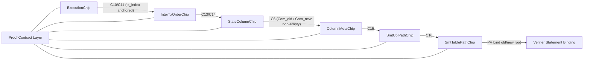

# Proof Architecture Adoption Review (M11 Stabilization)

> Date: 2026-02-20  
> Scope: `tabula-proof` architecture adoption decision for M11 completion, with M12/M13 compatibility constraints  
> Decision target: whether to adopt the proposed architecture changes now, partially, or later

---

## 1. Why this document exists

The current M11 branch passes tests, but key soundness closures are still open.  
This document evaluates the proposed architecture changes from three angles:

1. Cryptographic soundness closure
2. Delivery risk for M11
3. Forward compatibility with M12 (trace assembly) and M13 (prover/verifier)

This is an adoption decision document, not only a design sketch.

---

## 2. Current-state findings (evidence)

### 2.1 Critical gaps

| ID | Finding | Evidence |
|---|---|---|
| G1 | Write activity is not AIR-linked to `segment_is_touched` | `crates/tabula-proof/src/air/chips/state_column/air.rs:137`, `crates/tabula-proof/src/air/chips/state_column/air.rs:572` |
| G2 | `Com_new` send/receive path is touched-gated but delete-all edge is not explicitly modeled | `crates/tabula-proof/src/air/chips/state_column/air.rs:175`, `crates/tabula-proof/src/air/chips/column_meta/air.rs:183` |
| G3 | C10/C11 access bus payload omits tx/time anchor (`tx_index` or `tau`) | `crates/tabula-proof/src/air/bus.rs:182`, `crates/tabula-proof/src/air/chips/execution/air.rs:450`, `crates/tabula-proof/src/air/chips/inter_tx_order/air.rs:371` |
| G4 | `ApplyBatchStatement` contract (6 fields) is broader than active AIR binding | `crates/tabula-proof/src/statement.rs:7`, `crates/tabula-proof/src/air/chips/smt_path/air.rs:56` |
| G5 | Static table root binding is still deferred | `crates/tabula-proof/src/air/chips/static_table/mod.rs:4` |
| G6 | Infra bus coverage has placeholders for critical buses | `crates/tabula-proof/tests/infra/bus.rs:306`, `crates/tabula-proof/tests/infra/bus.rs:314` |

### 2.2 Why these are architectural, not local bugs

- G1/G2 are cross-chip invariant issues (`InterTxOrder` ↔ `StateColumn` ↔ `ColumnMeta`).
- G3 is an interface-level issue (bus schema), not a chip-local assertion.
- G4/G5 are protocol contract issues (public statement vs proof scope).
- G6 means future regressions can pass CI while violating intended topology.

---

## 3. Candidate architecture (what is being proposed)

The proposed architecture has five components:

1. **Canonical Proof Contract Layer**
2. **Anchored Access Bus (C10/C11 with tx anchor)**
3. **Touched-Write Closure**
4. **Segment Summary Invariants**
5. **Optional chip consolidation (`InterTxOrder + StateColumn`)**

The first four are M11-stabilization candidates.  
The fifth is an aggressive optimization candidate and should be evaluated separately.

---

## 4. Evaluation framework

We score each option on a 1-5 scale:

- `Soundness`: closes exploitable under-constraint classes
- `Delivery Risk`: lower is better for M11 schedule
- `Complexity`: implementation + review + test burden
- `M12 Fit`: supports deterministic trace assembly contracts
- `M13 Fit`: supports clean prover/verifier boundary

---

## 5. Option analysis

### Option O0: Keep current architecture as-is

- Pros
  - No refactor cost
  - Existing tests already green
- Cons
  - Leaves G1-G4 unresolved
  - Moves structural debt into M12/M13 where fixes are more expensive
  - Increases risk of proving the wrong statement

**Verdict:** Not acceptable.

### Option O1: Minimal local patches only (no interface changes)

- Pros
  - Fast to patch isolated constraints
  - Lower immediate merge conflict surface
- Cons
  - Cannot fully address G3 (bus anchoring) without interface change
  - Contract drift (G4) remains structural
  - Likely rework in M12 when trace contracts are frozen

**Verdict:** Better than O0, still insufficient.

### Option O2: Incremental architecture adoption (A-D now, E later)

- Includes
  - Canonical proof contract layer
  - C10/C11 anchoring with `tx_index`
  - touched/write closure in AIR
  - segment summary constraints and explicit delete-all modeling
- Pros
  - Closes known soundness gaps while keeping current chip boundaries
  - Produces stable cross-chip contracts before M12
  - Avoids high-risk big-bang rewrite
- Cons
  - Requires multi-chip edits and bus schema update
  - Needs significant test rewiring (infra + negative soundness tests)

**Verdict:** Recommended.

### Option O3: Full consolidation now (`InterTxOrder + StateColumn` merge)

- Pros
  - Cleaner single-chip state transition semantics
  - Eliminates C13/C14 bridge complexity
- Cons
  - Very high blast radius during M11
  - Invalidates existing traces/tests broadly
  - High schedule risk for M12/M13 dependency chain

**Verdict:** Do not do in current M11 window; revisit after M13 baseline.

---

## 6. Component-level adopt / defer decision

### 6.1 A. Canonical Proof Contract Layer — **Adopt now**

#### Goal

Create one canonical source for:

- public value layout
- bus tuple schemas
- chip ownership of each statement field

#### Why

Without this, statement/API and AIR evolve independently (G4).

#### Proposed structure

`crates/tabula-proof/src/contract/`:

- `public_values.rs`
- `bus_schema.rs`
- `statement_binding.rs`

#### Key rule

Every `ApplyBatchStatement` field must be either:

1. AIR-bound now, or
2. explicitly marked deferred with compile-time guard and test expectation

---

### 6.2 B. Anchored Access Bus (C10/C11) — **Adopt now**

#### Goal

Include `tx_index` in C10/C11 payload so InterTxOrder ordering is cryptographically anchored to Execution-origin events.

#### Current issue

`tx_index` is constrained in each chip but not tied across bus payloads.

#### Proposed payload changes

- C10: `(t, c, key[3], tx_index, val[W], is_null)`
- C11: `(t, c, key[3], tx_index, val[W], is_null)`

#### Notes

- Prefer in-place schema replacement over dual bus versions in this phase.
- Update `Execution send` + `InterTxOrder receive` together atomically.

---

### 6.3 C. Touched-Write Closure — **Adopt now**

#### Goal

Force `segment_is_touched` to represent actual write existence in the segment.

#### Minimal robust design

Add a segment write accumulator boolean in `StateColumn`:

- segment start: `write_seen = in_write`
- same segment: `next.write_seen = write_seen OR next.in_write`
- segment end: `segment_is_touched == write_seen`

#### Result

A witness cannot claim writes while suppressing touched.

---

### 6.4 D. Segment Summary + delete-all semantics — **Adopt now**

#### Goal

Make segment-end commitment behavior explicit for all cases.

#### Required explicit cases

1. touched + non-empty-new: `Com_new` comes from StateColumn chain via C6
2. touched + empty-new (delete-all): `Com_new` must be `Com_empty` path in ColumnMeta
3. untouched: `Com_new == Com_old`

#### Practical adjustment

Gate ColumnMeta `Com_new` C6 receive by `is_touched * (1 - is_empty_new)` instead of only `is_touched`.

This aligns with existing ability of StateColumn to emit only when a new-chain terminal exists.

---

### 6.5 E. `InterTxOrder + StateColumn` consolidation — **Defer**

#### Why defer

- High revalidation cost during critical-path milestone
- M11 objective is sound closure, not architecture reset

#### Revisit point

After M13 first end-to-end prove/verify success and benchmark baseline.

---

## 7. Is this worth adopting now? (Go/No-Go)

### Quantitative decision matrix

| Option | Soundness | Delivery Risk (inverse) | Complexity (inverse) | M12 Fit | M13 Fit | Overall |
|---|---:|---:|---:|---:|---:|---:|
| O0 As-is | 1 | 5 | 5 | 1 | 1 | 1.8 |
| O1 Local patch only | 2 | 4 | 4 | 2 | 2 | 2.8 |
| O2 Incremental adopt | 5 | 3 | 3 | 5 | 5 | 4.2 |
| O3 Full merge now | 5 | 1 | 1 | 4 | 4 | 3.0 |

### Final decision

**Adopt O2 now** (A/B/C/D), **defer O3**.

This gives the best soundness-to-risk ratio and preserves M12/M13 execution path.

---

## 8. Target architecture after O2 adoption

---

## 9. Delivery plan (M11 completion)

### Phase P0 (must complete)

1. Contract layer skeleton + public value layout constants
2. C10/C11 schema update with `tx_index`
3. touched/write closure constraints
4. delete-all explicit handling (`Com_new` receive gating fix)

### Phase P1 (validation hardening)

1. Replace C6/C8 placeholders with real infra tests
2. Add negative tests:
   - forged touched with writes
   - forged tx ordering not tied to execution
   - delete-all edge consistency
3. Add statement-to-PV mapping tests (length and offsets)

### Phase P2 (documentation and freeze)

1. Mark canonical architecture doc for proof pipeline
2. Mark stale docs as historical
3. Freeze bus schema for M12 trace-builder contract

---

## 10. Risk register and mitigations

| Risk | Impact | Mitigation |
|---|---|---|
| Bus schema update breaks many tests | Medium | Atomic multi-chip update + helper builders for payload construction |
| Additional columns increase trace width slightly | Low | Keep accumulators minimal (single boolean style) |
| delete-all handling mismatch with witness generator | Medium | Add end-to-end fixture for full delete transitions |
| Contract-layer drift over time | Medium | CI check: statement fields must map to binding status |

---

## 11. M12 and M13 implications

### M12

- Positive: stable and explicit bus contracts reduce ad-hoc trace conversion logic.
- Positive: contract layer becomes trace-builder source of truth.

### M13

- Positive: cleaner statement binding boundaries reduce prover/verifier ambiguity.
- Positive: public value contract can be validated before proving integration.

---

## 12. Acceptance criteria for “architecture adopted”

All must pass:

1. No known open soundness class from G1-G4 remains.
2. C6/C8 infra tests are non-placeholder and cover negative cases.
3. `ApplyBatchStatement` field binding status is explicit and test-enforced.
4. M12 trace-builder can consume frozen schema without temporary adapters.

---

## 13. Executive summary

- **Adopt now:** canonical contract layer, anchored C10/C11, touched/write closure, explicit delete-all handling.
- **Defer:** large chip consolidation.
- **Reason:** this is the only path that closes real soundness gaps without unacceptable M11 schedule risk.

