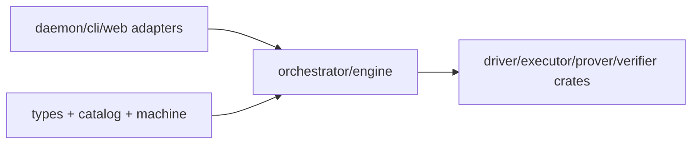

# Runtime Implementation Gate (State-Machine-First)

> Status: Locked Plan Before Refactor  
> Date: 2026-02-21  
> Scope: `tabula-orchestrator`, `tabula-daemon`, `tabula-cli`, `tabula-web-ide`

## 1. Why This Gate Exists

The runtime currently has state types in domain, but transition logic lives in one service file.  
This gate freezes file structure and ownership rules for the control-plane orchestrator.

## 2. Hard Rules (Non-Negotiable)

1. State transition rules are allowed only in `machine/*`.
2. Application layer can orchestrate IO/effects, but cannot encode business transition branching.
3. Daemon/CLI/Web layers are adapters only; no runtime semantics.
4. No new file may violate dependency direction defined in this document.
5. Refactor proceeds phase-by-phase; each phase must pass its gate before moving on.

## 3. Target Orchestrator Structure

```text
crates/tabula-orchestrator/src/
  lib.rs
  error.rs
  io.rs
  types/
    mod.rs
    ids.rs
    input.rs
    capabilities.rs
    state.rs            # program/instance/run contracts
  catalog/
    mod.rs
    store.rs            # immutable program registry store
  machine/
    mod.rs
    instance.rs         # instance transition guards/apply
    run.rs              # run transition decisions
  orchestrator/
    mod.rs
    engine.rs           # orchestrator trait + local engine
    tests.rs
```

## 4. Target Daemon Structure

```text
crates/tabula-daemon/src/
  lib.rs
  main.rs
  runtime/
    mod.rs
    config.rs
    state.rs
    shutdown.rs
  transport/
    mod.rs
    http/
      mod.rs
      router.rs
      middleware/
        mod.rs
        auth.rs
        blocking.rs
      handlers/
        mod.rs
        health.rs
        capabilities.rs
        programs.rs
        instances.rs
        runs.rs
      json.rs
      dto/
        mod.rs
        common.rs
        stateful.rs
        error.rs
```

## 5. Target Web IDE Structure

```text
crates/tabula-web-ide/src/web/
  mod.rs
  app/
    mod.rs
    shell.rs            # root component composition
    state.rs            # ui state + derived state
    actions.rs          # async flows register/create/submit/verify
  api/
    mod.rs
    client.rs
    dto.rs
  panels/
    mod.rs
    connection.rs
    program.rs
    state.rs
    batch.rs
    run.rs
    proof.rs
    diagnostics.rs
  storage/
    mod.rs
    workspace.rs
  templates.rs
```

## 6. Dependency Direction



Rules:
1. `types`/`machine` must not import daemon/web modules.
2. `machine` must be pure transition logic (no IO).
3. daemon handler must call only orchestrator engine trait.

## 7. File Migration Map (Current -> Target)

1. `/Users/wonj/Projects/tabula/crates/tabula-orchestrator/src/domain/stateful.rs`  
move to `types/state.rs`.
2. `/Users/wonj/Projects/tabula/crates/tabula-orchestrator/src/service.rs`  
move to `orchestrator/engine.rs` and split transition helpers into `machine/*`.
3. `/Users/wonj/Projects/tabula/crates/tabula-daemon/src/api/*`  
move to `transport/http/*`.
4. `/Users/wonj/Projects/tabula/crates/tabula-daemon/src/protocol/*`  
move to `transport/http/dto/*`.
5. `/Users/wonj/Projects/tabula/crates/tabula-web-ide/src/web/app.rs`  
split into `app/*` + `panels/*`.
6. `/Users/wonj/Projects/tabula/crates/tabula-web-ide/src/web/api.rs`  
split into `api/client.rs` + `api/dto.rs`.

## 8. Phase Plan with Gates

### Phase A: Skeleton First

Tasks:
1. Create new directories/modules with empty or pass-through implementations.
2. Keep behavior unchanged.
3. Compile green.

Gate:
1. `cargo check --workspace` passes.
2. No adapter imports inside `types`/`machine` modules.

### Phase B: Extract Pure Machines

Tasks:
1. Move transition guards and status updates into `machine/*`.
2. Implement `decide` and `evolve` unit tests.
3. Keep app layer thin.

Gate:
1. machine unit tests green.
2. no transition mutation remains outside `machine/*`.

### Phase C: App Service + Effects

Tasks:
1. Introduce explicit orchestration dispatcher inside `orchestrator/`.
2. Replace direct state mutation branches with machine decisions.
3. Keep in-memory local implementation.

Gate:
1. `submit_run/verify_run` behavior parity tests pass.
2. version conflict and fail-closed proof checks pass.

### Phase D: Adapter Rewire

Tasks:
1. daemon routes to new app service module.
2. cli/web flows use same stateful runtime contract.
3. clean old module names and re-exports.

Gate:
1. `cargo clippy --workspace --all-targets -- -D warnings` passes.
2. `cargo test --workspace` passes.
3. manual daemon e2e: register -> create -> submit(prove) -> verify passes.

## 9. Done Definition

1. No monolithic runtime transition file remains.
2. `types`, `catalog`, `machine`, `orchestrator` boundaries are physically visible in tree.
3. State transitions are testable without transport layer.
4. All stateful runtime APIs are green in daemon/cli/web.
