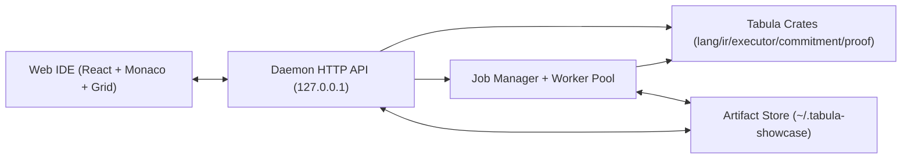

# Tabula Showcase IDE Design

> Status: Proposed (Adopt)
> Date: 2026-02-20
> Audience: Tabula kernel + demo product engineering
> Goal: 웹 접근성을 유지하면서 고연산(prove/verify)을 로컬 데몬으로 오프로드하는 완전한 하이브리드 설계

---

## 1. Executive Summary

이 설계는 **브라우저 Web IDE + 로컬 데몬** 구조를 채택한다.

최종 선택:

1. **UI 배포**: 순수 웹 앱 (React + Monaco)
2. **연산 백엔드**: `tabula-daemon` (Rust, localhost)
3. **입력 방식**: `Direct(JSON inline)` + `File(artifact/file ref)` 동시 지원
4. **작업 모델**: 경량(check/compile/execute)은 동기 호출, 고연산(prove/verify)은 비동기 job
5. **상태 반영 규칙**: verify 성공 + 루트/프로필/프로그램 digest 일치 시만 apply

핵심 이유:

1. 웹 접근성(설치 부담 최소) 확보
2. proving 계산량/메모리 부담을 브라우저에서 분리
3. 로컬 아티팩트 재현성과 디버깅 안정성 확보

데몬은 Web IDE 전용이 아니라, **CLI/자동화/에디터 플러그인도 공유 가능한
client-neutral local control plane**으로 정의한다.

---

## 2. Product Goals and Non-Goals

### 2.1 Goals

1. `.tab` 코드 작성, `check/compile/execute` 즉시 수행
2. 상태 테이블 편집/조회 및 실행 전후 diff 시각화
3. trace/read/write/emitted/consistency 확인
4. proof 생성/주입/검증 및 검증 성공 시 상태 반영
5. 모든 결과를 재현 가능한 artifact로 보존

### 2.2 Non-Goals (v1)

1. 실시간 다중 사용자 협업
2. 원격 proving 클러스터 운영
3. 브라우저-only proving 보장
4. 프로덕션 키/지갑 기능

---

## 3. Final Decisions (All Resolved)

| Decision Area | Final Choice | Why |
|---|---|---|
| UX 형태 | Hosted Web IDE | 접근성/공유성 최적 |
| 고연산 처리 | 로컬 daemon 위임 | 성능/안정성/자원제어 |
| 입력 방식 | Direct + File dual-mode | 작은/큰 입력 모두 최적 처리 |
| 기본 실행 경로 | Daemon direct crate call | shell 의존 최소, typed error 유지 |
| proving 기본 경로 | Daemon worker job | 취소/진행률/격리 용이 |
| 상태 반영 | verify gate 통과 시만 적용 | 안전한 상태 전이 |
| 영속화 | 로컬 artifact store | 재현성/감사 가능성 |
| 브라우저-데몬 연결 | localhost API + fallback local UI | 웹 접근성과 연결 안정성 동시 확보 |

---

## 4. System Architecture



### 4.1 Client Delivery Modes

1. Hosted mode: 정적 웹앱(`https://...`) 접속
2. Local-served mode: 데몬이 동일 UI 번들을 `http://127.0.0.1:<port>/ui`로 제공

Fallback 규칙:

1. Hosted mode에서 localhost 접근 실패 시 Local-served mode 안내
2. 데몬 미설치 시 read-only playground 모드로 제한

### 4.2 Daemon Runtime Stack

1. `crates/daemon` (신규)
2. HTTP + WebSocket/SSE API
3. Job manager (queued/running/cancelled/succeeded/failed)
4. Core engine bridge (`tabula-lang`, `tabula-ir`, `tabula-executor`, `tabula-proof`)

---

## 5. Input Transport Model (Direct + File)

### 5.1 Unified InputRef

```json
{
  "kind": "inline" | "file" | "artifact",
  "inline": { "...": "json payload" },
  "file_path": "/abs/path/to/input.json",
  "artifact_id": "art_..."
}
```

### 5.2 Direct Mode

용도:

1. 작은 payload (`check`, 짧은 `execute`)
2. 빠른 반복 편집 루프

특징:

1. request body에 직접 JSON 포함
2. 서버가 즉시 파싱/검증 후 실행

### 5.3 File Mode

용도:

1. 큰 state/batch/proof 파일
2. prove/verify 장시간 작업

특징:

1. 로컬 파일 경로 참조 또는 staged upload
2. 실행 시 파일 hash/size 메타를 함께 기록

### 5.4 Auto-Selection Policy

1. 기본은 Direct
2. payload가 임계치(예: 256KB) 초과하면 File mode로 자동 전환
3. `prove/verify`는 기본 File mode

---

## 6. Web API Contract

### 6.1 Capability and Health

1. `GET /v1/health`
2. `GET /v1/capabilities`

응답 예:

```json
{
  "compile": true,
  "execute": true,
  "prove": false,
  "verify": true,
  "input_modes": ["inline", "file", "artifact"]
}
```

### 6.2 Check / Compile / Execute

1. `POST /v1/check`
2. `POST /v1/compile`
3. `POST /v1/execute`

공통 요청:

```json
{
  "program": { "kind": "inline", "inline": { "source": "table ..." } },
  "state": { "kind": "inline", "inline": { "cells": [] } },
  "batch": { "kind": "inline", "inline": { "transactions": [] } },
  "include_trace": true
}
```

### 6.3 Prove / Verify (Job)

1. `POST /v1/jobs/prove`
2. `POST /v1/jobs/verify`
3. `GET /v1/jobs/{job_id}`
4. `POST /v1/jobs/{job_id}/cancel`
5. `GET /v1/events` (SSE) or `WS /v1/ws`

Job 상태:

1. `queued`
2. `running`
3. `succeeded`
4. `failed`
5. `cancelled`

### 6.4 Artifact and File APIs

1. `POST /v1/files/stage`
2. `POST /v1/artifacts/import`
3. `GET /v1/artifacts/{id}`
4. `GET /v1/artifacts/{id}/download`

---

## 7. Information Architecture (UI)

### 7.1 Main Layout

1. Left: Project tree + scenario templates
2. Center: `.tab` editor (Monaco)
3. Right top: State table editor
4. Right bottom: Batch builder
5. Bottom tabs:
   - Diagnostics
   - Compiled IR JSON
   - Execution trace timeline
   - Read/Write diff
   - Job monitor (prove/verify)
   - Verify report

### 7.2 Primary Actions

1. `Check`
2. `Compile`
3. `Execute`
4. `Generate Proof`
5. `Import Proof`
6. `Verify + Apply`

### 7.3 UX Rules

1. Execute 성공 시 변경 cell 강조
2. 실패 tx는 reason + failed instruction index 표시
3. Verify 실패 시 apply 비활성화
4. Verify 성공 + gate 통과 시 apply 버튼 활성화

---

## 8. State Transition Gates

`Verify + Apply`는 다음을 모두 만족해야 한다.

1. `verify_report.ok == true`
2. `verify_report.statement.old_state_root == current_state_root`
3. `semantic_profile_hash` 일치
4. `program_digest` 일치

조건 불충족 시:

1. 상태 반영 금지
2. 불일치 원인(어느 필드가 달랐는지) 명시

---

## 9. Persistence Layout

```text
~/.tabula-showcase/
  projects/<project_id>/
    project.toml
    program.tab
    program.json
    state.json
    batch.json
    runs/<run_id>/result.json
    runs/<run_id>/state_after.json
    proofs/<proof_id>/statement.json
    proofs/<proof_id>/public_inputs.json
    proofs/<proof_id>/proof.bin
  jobs/<job_id>/job.json
  logs/daemon.log
```

규칙:

1. run/proof artifact는 immutable
2. working state는 `state.json`으로 명시 반영
3. artifact마다 toolchain/version/hash 메타 포함

---

## 10. Security and Safety

1. daemon은 기본 `127.0.0.1` 바인딩만 허용
2. 세션 토큰 기반 인증(`Authorization: Bearer <token>`)
3. 허용 origin 화이트리스트(CORS)
4. shell 인젝션 방지를 위한 고정 argv 실행
5. 파일 크기/총 job 메모리 제한
6. path traversal 방지(프로젝트 루트/허용 경로 검증)
7. verify 실패 시 상태 절대 불변

---

## 11. Performance Targets (v1)

1. `check` p50 < 150ms
2. `compile` p50 < 300ms
3. `execute` (1k tx, transfer) p50 < 2s
4. prove/verify는 progress 이벤트를 1초 주기로 송신
5. UI first interactive < 1.5s

---

## 12. Testing Strategy

### 12.1 Daemon

1. API contract tests (OpenAPI 스냅샷)
2. check/compile/execute golden tests
3. Direct/File mode parity tests
4. prove/verify job lifecycle tests

### 12.2 Frontend

1. component tests (editor/grid/diff/job monitor)
2. Playwright E2E:
   - Direct mode execute
   - File mode execute
   - proof import/verify/apply

### 12.3 Determinism

1. 동일 입력 다회 실행 hash 동일성
2. semantic profile mismatch negative tests

---

## 13. Implementation Plan

### Phase A (2주): Daemon Foundation

1. `crates/daemon` scaffold
2. health/capabilities/check/compile/execute API
3. artifact store 기본 구조

### Phase B (2주): Web IDE Core

1. Monaco + diagnostics
2. state/batch editor
3. execute trace/diff 패널
4. Direct/File mode 전환 로직

### Phase C (2주): Proof Job Pipeline

1. prove/verify job API + worker pool
2. job progress stream(SSE/WS)
3. verify gate + apply flow

### Phase D (1~2주): Hardening

1. 보안/CORS/토큰 정책 고정
2. E2E + 부하 테스트
3. demo preset/export-import polish

---

## 14. Why This Over Alternatives

1. Pure WASM proving 대비: 성능/메모리/안정성 우수
2. Native-only 앱 대비: 웹 접근성 우수
3. Remote-only 서비스 대비: 로컬 재현성/오프라인 사용성 우수

---

## 15. Definition of Done (v1)

아래를 하나의 웹 UX에서 재현 가능하면 완료:

1. `.tab` 작성 후 check/compile 성공
2. state/batch 편집 후 execute 및 diff/trace 확인
3. proof 생성 또는 import
4. verify 성공 시 gate 통과 후 apply
5. 프로젝트 재오픈 시 동일 artifact 재현
