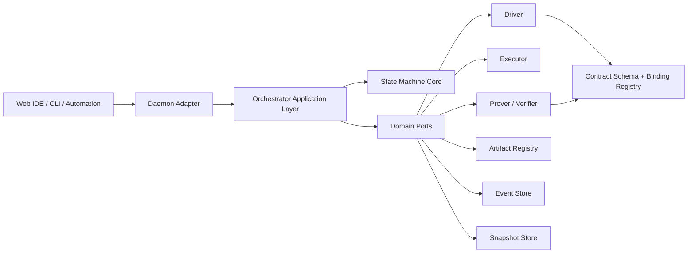
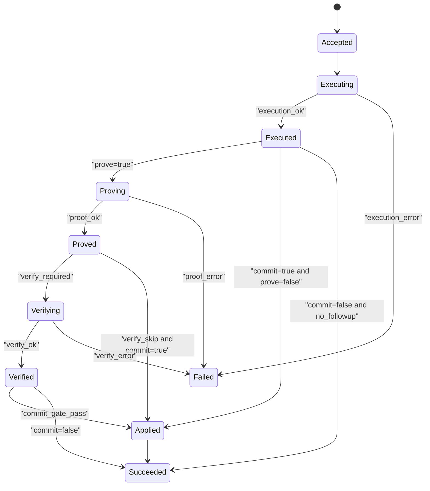
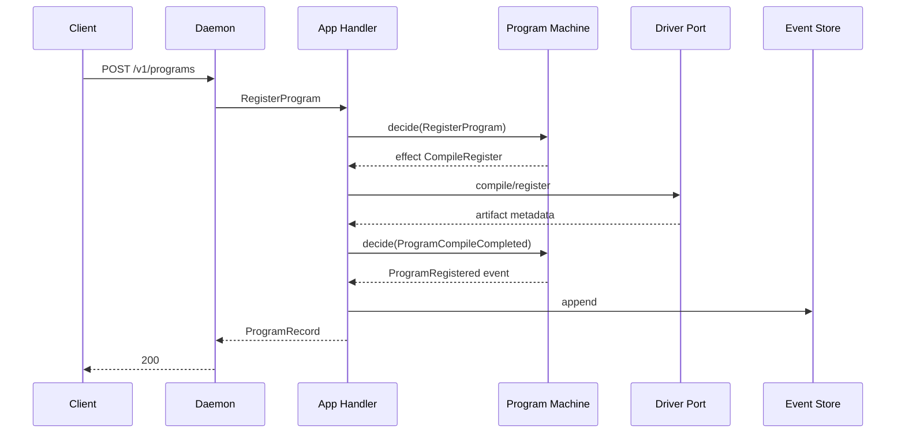
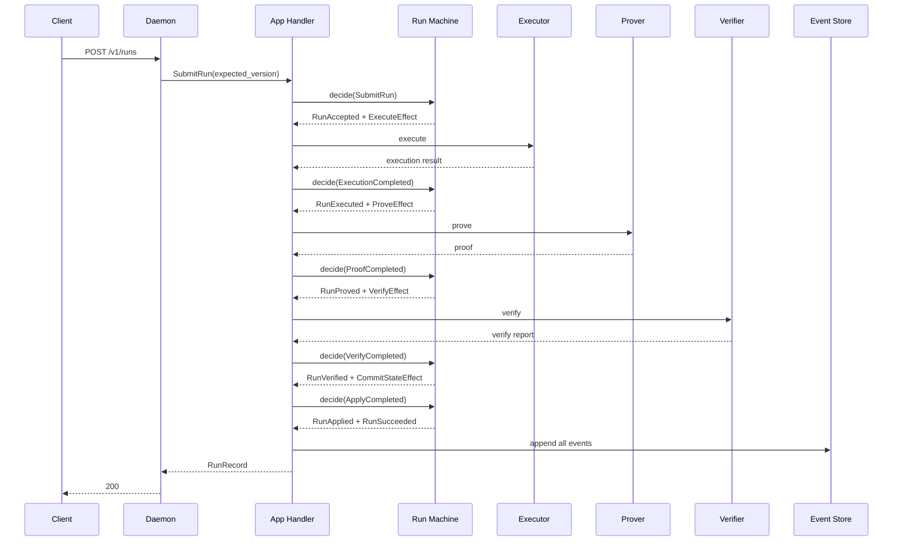

# State-Machine-Centric Runtime Architecture and Migration Plan

> Status: Proposed (authoritative runtime design)
> Date: 2026-02-21
> Audience: orchestrator/daemon/cli/web maintainers
> Companion docs:
> - [final-target-architecture.md](./final-target-architecture.md)
> - [showcase-ide-design.md](./showcase-ide-design.md)
> - [runtime-implementation-gate.md](./runtime-implementation-gate.md)

---

## 1. Purpose

This document defines the runtime architecture where **domain state machines are the single owner of transition logic**.

The main objective is to eliminate ambiguity around ownership:

1. State transitions and invariants live only in state-machine modules.
2. Orchestrator application layer coordinates ports/effects, but does not own business rules.
3. Daemon/CLI/Web are transport adapters only.

If any runtime rule appears outside the state machine, architecture is considered violated.

---

## 2. Problem Statement

The prior structure drifted toward a service-centric organization where runtime behavior could be inferred from one large service file. This caused the following risks:

1. Rules, effects, and storage updates were mixed in one location.
2. Adapter boundaries were less explicit (risk of behavior duplication).
3. Transition correctness could not be validated as pure logic.
4. Future backends (STARK prover, remote runner, durable stores) would be harder to integrate cleanly.

The correction is to move to **machine-first modeling**.

---

## 3. Design Principles

1. **Machine First**
- Every business transition is command/event-driven and pure.

2. **Ports and Adapters**
- Side effects are abstracted by ports.
- Runtime wiring is adapter-specific, not domain-specific.

3. **Determinism by Construction**
- Stable hashing, canonical ordering, replay-safe events.

4. **Fail Closed**
- Version mismatch, hash mismatch, metadata mismatch, or proof mismatch must stop progression.

5. **Big-Bang Cutover**
- Migration is one-shot: remove stateless/legacy endpoints and keep a single stateful runtime contract.

---

## 4. Scope and Non-Goals

### 4.1 In Scope

1. Program registration lifecycle.
2. Instance state lifecycle.
3. Run lifecycle (execute/prove/verify/apply gates).
4. Adapter contract stabilization (daemon API).
5. Event/snapshot/read-model architecture.

### 4.2 Non-Goals (This Document)

1. Full STARK circuit architecture details.
2. Distributed cluster scheduling design.
3. Multi-tenant authorization model beyond local daemon.

---

## 5. Target Architecture (Layered)

### 5.1 Role Ownership

1. `State Machine Core`
- Command validation.
- Guard evaluation.
- Event emission decision.
- No IO.

2. `Application Layer`
- Load aggregate state from store.
- Invoke machine.
- Execute effects through ports.
- Append events.
- Update projections/snapshots.

3. `Adapter Layer`
- Decode/encode transport payloads.
- Enforce auth/body limits/timeouts/backpressure.
- Map domain errors to transport errors.

---

## 6. Runtime Domain Model

### 6.1 IDs

1. `ProgramId`: immutable program handle.
2. `InstanceId`: mutable runtime state handle bound to one program.
3. `RunId`: execution attempt handle on one instance.
4. `EventId`: monotonic or ULID/UUID for append ordering.
5. `CorrelationId`: cross-layer trace id.

### 6.2 Aggregates

1. `ProgramAggregate`
- Identity: `program_id`.
- Core fields: program artifact hash, profile hash, metadata hash.
- Lifecycle: `Registered` only (immutable).

2. `InstanceAggregate`
- Identity: `instance_id`.
- Fields: `program_id`, `version`, `status`, `state_hash`.
- Lifecycle: `Ready | Busy | Archived` (Busy may be logical, not persisted long-term).

3. `RunAggregate`
- Identity: `run_id`.
- Fields: run status, execution summary, optional proof/verify artifacts.
- Lifecycle: multi-step (see section 8).

---

## 7. Bounded Contexts

1. `Program Registry Context`
- Input: register/get/list program.
- Output: immutable program record.

2. `Instance State Context`
- Input: create/get/list instance.
- Output: versioned mutable state.

3. `Run Lifecycle Context`
- Input: submit/get/list run.
- Output: run lifecycle transitions + optional state commit.

4. `Proof Context`
- Input: execution statement and backend options.
- Output: proof/verification artifacts and gate outcome.

---

## 8. State Machine Specification

### 8.1 Program Machine

State:
1. `None`
2. `Registered`

Commands:
1. `RegisterProgram`
2. `GetProgram`
3. `ListPrograms`

Events:
1. `ProgramRegistered`

Guards:
1. Program artifact and metadata must validate via driver policy.

### 8.2 Instance Machine

State:
1. `None`
2. `Ready`
3. `Archived`

Commands:
1. `CreateInstance`
2. `ArchiveInstance` (future)
3. `GetInstance`
4. `ListInstances`

Events:
1. `InstanceCreated`
2. `InstanceArchived` (future)
3. `InstanceStateCommitted`

Guards:
1. `program_id` must exist.
2. Initial state must be valid/canonical.

### 8.3 Run Machine

State:
1. `Accepted`
2. `Executing`
3. `Executed`
4. `Proving`
5. `Proved`
6. `Verifying`
7. `Verified`
8. `Applied`
9. `Succeeded`
10. `Failed`

Commands:
1. `SubmitRun`
2. `GetRun`
3. `ListRuns`

System/Internal Commands:
1. `ExecutionCompleted`
2. `ExecutionFailed`
3. `ProofCompleted`
4. `ProofFailed`
5. `VerifyCompleted`
6. `VerifyFailed`
7. `ApplyCompleted`
8. `ApplyFailed`

Events:
1. `RunAccepted`
2. `RunExecutionStarted`
3. `RunExecuted`
4. `RunProvingStarted`
5. `RunProved`
6. `RunVerifyingStarted`
7. `RunVerified`
8. `RunApplyStarted`
9. `RunApplied`
10. `RunSucceeded`
11. `RunFailed`

### 8.4 Transition Guard Matrix (Normative)

| Command | Current State | Required Guards | Produced Events | Produced Effects |
|---|---|---|---|---|
| `RegisterProgram` | none | source/artifact parse success, metadata policy pass | `ProgramRegistered` | `CompileRegister` (if source input) |
| `CreateInstance` | none | `program_id` exists, initial state valid | `InstanceCreated` | none |
| `SubmitRun` | instance ready | instance exists, status active, optional expected version match | `RunAccepted`, `RunExecutionStarted` | `ExecuteBatchEffect` |
| `ExecutionCompleted` | run executing | execution result schema valid | `RunExecuted` | optional `ProveEffect`, optional `CommitStateEffect` |
| `ExecutionFailed` | run executing | failure reason present | `RunFailed` | none |
| `ProofCompleted` | run proving | proof artifact schema valid | `RunProved` | optional `VerifyEffect`, optional `CommitStateEffect` |
| `ProofFailed` | run proving | failure reason present | `RunFailed` | none |
| `VerifyCompleted` | run verifying | `verify_ok`, statement/profile/program hash all match when gate enabled | `RunVerified` | optional `CommitStateEffect` |
| `VerifyFailed` | run verifying | failure reason present | `RunFailed` | none |
| `ApplyCompleted` | run verified or executed | commit policy allows apply | `RunApplied`, `InstanceStateCommitted`, `RunSucceeded` | optional `PersistArtifactEffect` |
| `ApplyFailed` | run applying | failure reason present | `RunFailed` | none |

---

## 9. Command / Event / Effect Contracts

### 9.1 Command Envelope (Logical)

Fields:
1. `command_id`
2. `command_type`
3. `aggregate_id`
4. `expected_version` (optional)
5. `payload`
6. `issued_at_ms`
7. `correlation_id`

### 9.2 Event Envelope

Fields:
1. `event_id`
2. `event_type`
3. `aggregate_type`
4. `aggregate_id`
5. `aggregate_version`
6. `payload`
7. `created_at_ms`
8. `causation_id`
9. `correlation_id`

### 9.3 Effects (Application Layer Instructions)

Effect types:
1. `ExecuteBatchEffect`
2. `ProveEffect`
3. `VerifyEffect`
4. `PersistArtifactEffect`
5. `CommitStateEffect`

Rule:
1. Machine can request effects.
2. Only app layer can execute effects.
3. Effect results return as internal commands/events.

---

## 10. Persistence Model

### 10.1 Event Store

Requirements:
1. Append-only per aggregate stream.
2. Conditional append on expected version.
3. Read stream by aggregate id.
4. Pagination by global sequence.

### 10.2 Snapshot Store

Requirements:
1. Optional optimization; source of truth remains events.
2. Snapshot includes `last_event_version`.
3. Snapshot invalidation on append conflict.

### 10.3 Read Models

Read model projections:
1. `programs_view`
2. `instances_view`
3. `runs_view`

Rule:
1. Adapters query read models, not domain internals.

---

## 11. Consistency and Concurrency

1. `expected_instance_version` required for `SubmitRun` in strict mode.
2. Conflict (`409`) on version mismatch.
3. Idempotency key support for retries (future requirement).
4. At-least-once internal effect execution is acceptable only with idempotent reducers.

---

## 12. Port Interfaces (Conceptual)

1. `CompilerPort`
- `compile_and_register(program_input) -> ProgramArtifactMeta`

2. `ExecutorPort`
- `execute(program_artifact, state, batch, options) -> ExecutionResult`

3. `ProverPort`
- `prove(statement, execution_trace) -> ProofArtifact`

4. `VerifierPort`
- `verify(statement, proof) -> VerifyReport`

5. `EventStorePort`
- `load_stream(aggregate)`
- `append(stream, expected_version, events)`

6. `SnapshotStorePort`
- `load_snapshot(aggregate)`
- `save_snapshot(aggregate, version, state)`

7. `ArtifactRegistryPort`
- `put/get/list` for immutable artifacts.

---

## 13. Adapter Contract (Daemon)

### 13.1 Endpoint Set

Stateful:
1. `POST /v1/programs`
2. `GET /v1/programs`
3. `GET /v1/programs/{program_id}`
4. `POST /v1/instances`
5. `GET /v1/instances`
6. `GET /v1/instances/{instance_id}`
7. `POST /v1/runs`
8. `GET /v1/runs`
9. `GET /v1/runs/{run_id}`
10. `POST /v1/runs/{run_id}` (verify run proof)

### 13.2 Adapter Rules

1. No direct call to driver/executor/prover bypassing app layer.
2. No business transition branching in handler code.
3. All domain errors must map through one error mapper.

---

## 14. Error Model

### 14.1 Domain Error Categories

1. `BadRequest`
2. `Forbidden`
3. `Unprocessable`
4. `NotImplemented`
5. `NotFound`
6. `Conflict`
7. `Internal`

### 14.2 HTTP Mapping

1. `BadRequest -> 400`
2. `Forbidden -> 403`
3. `NotFound -> 404`
4. `Conflict -> 409`
5. `Unprocessable -> 422`
6. `NotImplemented -> 501`
7. `Internal -> 500`

### 14.3 Retry Semantics

1. `409`: caller can retry with refreshed version.
2. `422`: caller must change payload.
3. `500/503/504`: caller may retry with backoff.

---

## 15. Security and Trust Boundaries

1. Daemon default bind: localhost only.
2. Bearer token optional but recommended when exposed.
3. File input restricted by allow-list roots.
4. Proof verify gate required before apply when proof mode enabled.
5. Artifact hashes and profile hashes are mandatory gate inputs.

---

## 16. Observability

### 16.1 Logs

Fields:
1. `correlation_id`
2. `command_id`
3. `aggregate_id`
4. `run_id`
5. `phase`
6. `duration_ms`
7. `result`

### 16.2 Metrics

1. `commands_total{type,status}`
2. `command_latency_ms{type}`
3. `run_phase_latency_ms{phase}`
4. `conflicts_total`
5. `proof_verify_fail_total{reason}`

### 16.3 Tracing

1. One trace per command.
2. Spans: adapter decode -> app decide -> effect -> append -> response.

---

## 17. Detailed Runtime Scenarios

### 17.1 Register Program Scenario

### 17.2 Submit Run Scenario (prove+verify+commit)

---

## 18. Migration Plan (Detailed)

## Phase 0: Freeze and Safety Net

Tasks:
1. Capture current endpoint snapshots.
2. Add end-to-end fixture corpus for `register/create/submit/get/list`.
3. Freeze stateful error code enums and response schemas.

Exit criteria:
1. Snapshot tests green in CI.
2. No schema drift in public responses.

## Phase 1: Extract Pure Machine Modules

Tasks:
1. Create `machine/state.rs`, `machine/command.rs`, `machine/event.rs`.
2. Implement pure `decide/evolve` for Program/Instance/Run.
3. Move all invariant checks from service methods to machine guards.

Exit criteria:
1. Machine unit/property tests pass without ports.
2. App/adapters compile against machine API.

## Phase 2: Build Application Command Handler

Tasks:
1. Add `app/command_handler.rs`.
2. Introduce internal effect queue/dispatch model.
3. Wire local in-memory ports for current behavior parity.

Exit criteria:
1. Behavior parity tests against previous outputs pass.
2. No direct effect execution in adapter handlers.

## Phase 3: Event Store + Snapshot Introduction

Tasks:
1. Define `EventStorePort` and `SnapshotStorePort` traits.
2. Implement in-memory append with expected-version check.
3. Add snapshot rebuild and projection updater.

Exit criteria:
1. Replay from events restores same read model.
2. Version conflict path returns deterministic 409.

## Phase 4: Proof Pipeline Hardening

Tasks:
1. Replace placeholder verification gate path with proof-port contract.
2. Enforce apply gate: `verify_ok + statement/profile/program hash match`.
3. Add negative mismatch tests.

Exit criteria:
1. e2e prove/verify/apply path green.
2. fail-closed tests for mismatch green.

## Phase 5: Adapter Convergence

Tasks:
1. Make CLI call app handler path (local/remote mode).
2. Make Web IDE stateful path primary.
3. Remove all stateless endpoints and transport DTOs.

Exit criteria:
1. Same command input yields same run record across adapter types.
2. No adapter-specific behavior divergence.

## Phase 6: Durability and Recovery (Optional but recommended)

Tasks:
1. Add durable event store implementation.
2. Add restart recovery from snapshot+tail events.
3. Add projection rebuild command.

Exit criteria:
1. restart/recovery e2e tests green.

### 18.7 Suggested 8-Week Execution Timeline

1. Week 1: Phase 0 complete (fixtures/snapshots/freeze).
2. Week 2-3: Phase 1 complete (machine extraction + guard/property tests).
3. Week 4-5: Phase 2 complete (app handler/effect orchestration).
4. Week 6: Phase 3 complete (event store/snapshot/read model).
5. Week 7: Phase 4 complete (proof gate hardening + negative suites).
6. Week 8: Phase 5 baseline complete (adapter convergence + parity report).

Gate for Week 8 exit:
1. `cargo clippy --workspace --all-targets -- -D warnings` green.
2. full e2e matrix green.
3. no transition rule outside `machine/` by static code review checklist.

---

## 19. Test Strategy Matrix

| Layer | Test Type | Mandatory Cases |
|---|---|---|
| machine | unit/property | legal/illegal transitions, guards, version mismatch |
| app | integration (fake ports) | effect orchestration, append ordering, retries |
| store | integration | append conflict, replay determinism, snapshot parity |
| daemon | contract | endpoint schema/status/error mapping/auth |
| e2e | scenario | register->create->submit->prove->verify->apply |

### 19.1 Must-Have Negative Tests

1. stale `expected_instance_version`.
2. invalid state cell payload.
3. invalid batch tx payload.
4. profile hash mismatch.
5. proof statement mismatch.
6. adapter unauthorized request.

---

## 20. Definition of Done

Architecture is considered adopted when all conditions hold:

1. Transition rules exist only in `machine/`.
2. Adapters contain zero business transition logic.
3. App layer owns effect orchestration and store append sequencing.
4. Event replay reconstructs program/instance/run read models deterministically.
5. Proof gate logic is fail-closed and end-to-end validated.

---

## 21. Open Questions

1. Should `Run` become fully asynchronous job model by default?
2. Do we require idempotency keys in v1 of stateful API?
3. Should daemon expose event-stream endpoint for run phase updates?
4. Which durable store is first target for event persistence?

These questions do not block Phase 1-3, but must be decided before broad production rollout.
